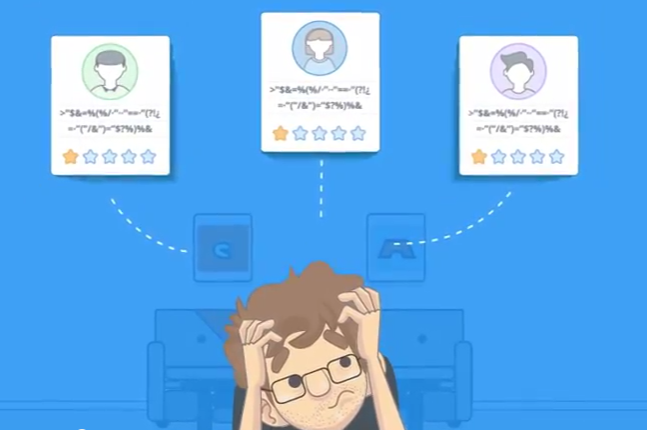
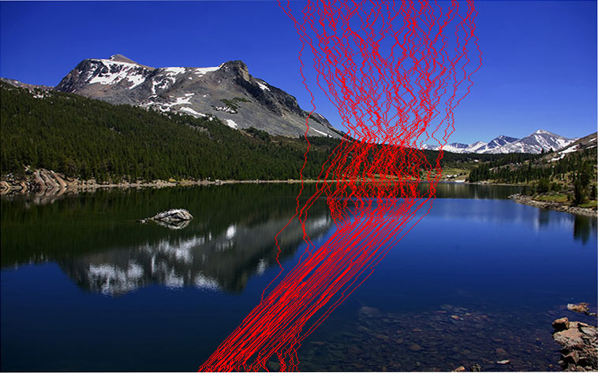
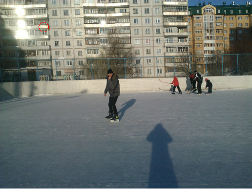
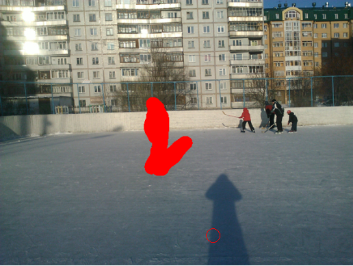
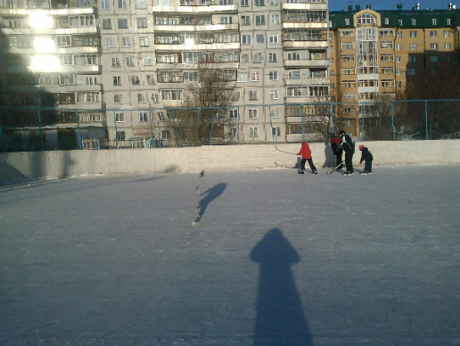
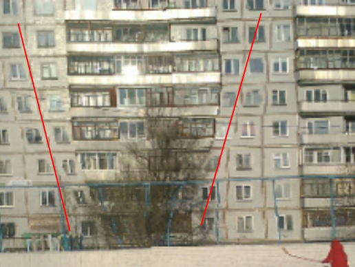
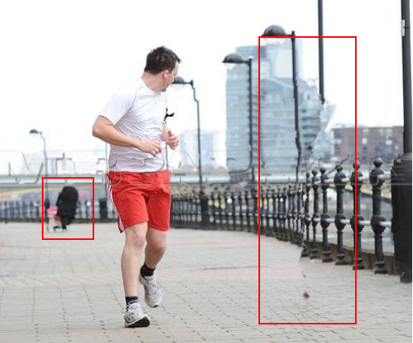
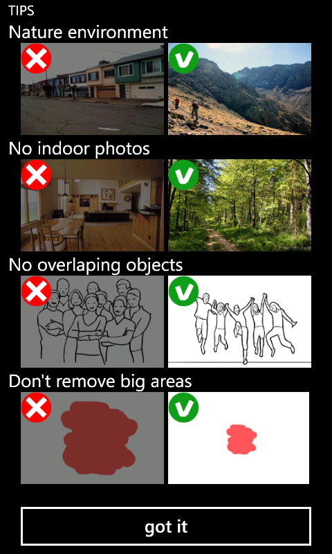
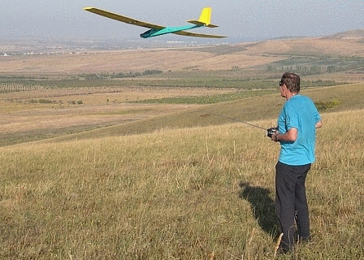
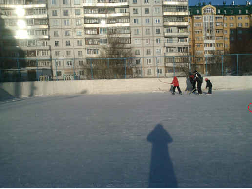

@title[Title]

# Azure Durable Functions

Sergey Zavoloka

// TODO: insert contacts, picture etc

---
@title[Agenda]

## Agenda
- Domain
- Durable functions
- Application
- Tips

---

- 2012 TechDays
- Talks about Windows Phone 7

---
@title[Smartest Eraser]

Mobile app to remove objects from pictures

---?image=images/nextappstar.png&position=left&size=auto 45%

@title[NextAppStar]

- Next App Star Competition
- 9000 apps participated |
- only 128 in final |
- Smartest Eraser in top 32 |

---

@title[Bad reviews]

Bad reviews!

---

App uses Seam Carving

+++
<!-- .slide: data-transition="none" -->

+++
<!-- .slide: data-transition="none" -->

+++
<!-- .slide: data-transition="none" -->

+++
<!-- .slide: data-transition="none" -->

+++

+++
<!-- .slide: data-transition="none" -->

+++
<!-- .slide: data-transition="none" -->

+++
<!-- .slide: data-transition="none" -->

---

Simplest wat is to explain 

 
<!--  -->

---

Users wanted more intellingent functionality

---

@title[New method]

After long studies a new method was ready!

+++

+++

+++

+++

---

What happened with the issues?

+++
<!-- .slide: data-transition="none" -->

+++
<!-- .slide: data-transition="none" -->

+++
<!-- .slide: data-transition="none" -->

+++

+++
<!-- .slide: data-transition="none" -->

+++
<!-- .slide: data-transition="none" -->

---

TODO: Simple Inpaint algorithm schema

---

Mobiles are not capable of such computation power

---

- Azure Cloud Services
  - Worker roles

---

TODO: How difficult to use worker
- one worker many users |
- reacts on message in a queue |
- difficult to scale |

---

| INSTANCE	| CORES |	RAM	| PRICE |
| ---|---|---|---|
| A0 | 1 | 0.75 GB | $0.02/hour |
| A1 | 1 | 1.75 GB | $0.08/hour |
| A2 | 2 | 3.50 GB | $0.16/hour |
| A3 | 4 | 7.00 GB | $0.32/hour |
| A4 | 8 | 14.00 GB | $0.64/hour |

---

| instance | price per month|
| --- | ---|
| A0 | 24 &ast; 30 &ast; $0.02 = $14.4|
| A1 | 24 &ast; 30 &ast; $0.08 = $57.6|
| A2 | 24 &ast; 30 &ast; $0.16 = $115.2|

---

- Azure functions
  - Pay for usage (real) |
  - Scale |

---

TODO: How to orchestrate

---

- Limited lifetime |
- Difficult to orchestrate |

---

TODO: Durable functions - what it is?

- description
- prerelease version
- how to reference the NuGet

---

TODO: How to orchestrate

---

TODO: Converted app into Durable without Activities. 

---

TODO: Reasons to use Activities

- Parallalization
- Restores in case of failure

---

TODO: How I failed to switch to Activities

- No awaits within Orcestrate |
- Serializable inputs |
- 60KB payloads |

---

TODO: Replay functionality (strips)

 - how stupid is the orchestration
 -
 
---

TODO: Demonstration of reply in Azure

---

TODO: Explain how Durable works under the hood

---

TODO: Use of sub orchestrations

---

TODO: Possible optimizations
- Sub Orchestrations |
- Minimize reads from storage |
- Use in-memory (REDIS) |

---

TODO: Diagnostics

---

TODO: Deployments

- I had issue referencing a project

---

|||
|---|--|
| Cost of one minute | 0.128GB * 60000ms = 7680 Gs|
| Free GB-s per month | 400,000 free ~ 52 min |
| Free executions | 1,000,000 |
| Avg Time of one erase| 2 min |
| One erase cost | $0.000016 * 120,000ms ~ $0.2|
| Cost of one hour | $7.3 |
| Cost of one mln exec | $0.20|

---

## Key take aways
- item1 

---

# Q&A
Thank you!

// TODO: insert contacts, picture etc
